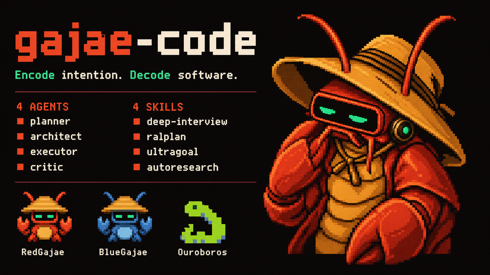
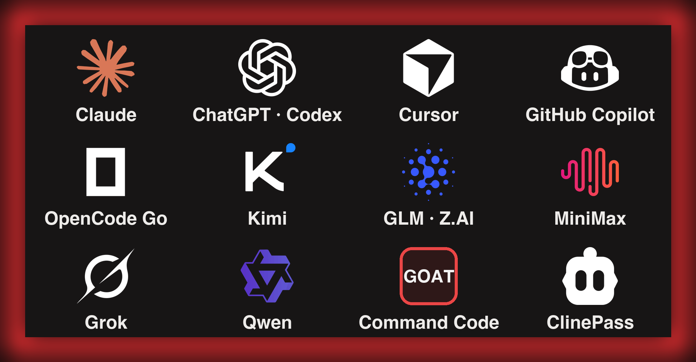

<p align="right">
  <a href="README.md">English</a> | <a href="README.ko.md">한국어</a> | <a href="README.zh-CN.md">中文</a> | <strong>日本語</strong>
</p>

<p align="center">
  
</p>

<h1 align="center">G A J A E - C O D E</h1>

<p align="center">
  <strong>Encode intention. Decode software.</strong>
  <br/>
  <sub><strong>すでに払っているプラン</strong>で動き、スマホに答えを届けるコーディングエージェント。</sub>
</p>

<p align="center">
  <a href="https://gajae-code.com"></a>
  <a href="https://www.npmjs.com/package/gajae-code"></a>
  <a href="LICENSE"></a>
  <a href="https://discord.gg/wSyUQYfhAw"></a>
</p>

<p align="center">
  <a href="#クイックスタート">クイックスタート</a> ·
  <a href="#なぜ-gajae-code-なのか">なぜ</a> ·
  <a href="#手持ちのコーディングプランで">コーディングプラン</a> ·
  <a href="#スマホで答える">スマホ</a> ·
  <a href="#変更の前に計画">ワークフロー</a> ·
  <a href="#トークンを節約">トークン節約</a> ·
  <a href="#openclaw--hermes--grokbot--自分の-bot-に-gjc-を動かさせる">コントローラ</a> ·
  <a href="#paseoorcat3-code-の中で-gjc-を動かす">エージェントシェル</a> ·
  <a href="#ドキュメント">ドキュメント</a>
</p>

**すでに持っているサブスクリプションでログインし、ファイルが 1 つ変わる前に計画し、証拠とともに実行する — エージェントからの質問にはターミナル・スマホ・自前の bot、どこからでも答えられます。**

Gajae-Code（`gjc`）は外付けのコーディングエージェントハーネスです。任意のリポジトリやワークツリーに放り込むだけ。追加の API 課金なし。トークン単価の不安なし。ターミナルの張り付きも不要。

> Gajae-Code は実験的なベータ段階のプロジェクトです。粗い部分が残っている可能性があるため、重要な作業では出力を検証してから利用してください。
>
> 本書は英語版 [README.md](README.md) の翻訳です。内容に差異がある場合は英語版が正（SSOT）です。

---

## なぜ Gajae-Code なのか

多くのコーディングエージェントは 3 つの場所で破綻します: 二重に課金し、理解する前にコードを変更し、キーボードを離れた瞬間に沈黙します。

| 問題 | 何が起きるか | Gajae-Code の解決策 |
| :--- | :--- | :--- |
| 別建ての API 課金 | プラン料金*に加えて*トークン従量の API 費用 | すでに払っているコーディングプランで `/login` — Claude、Codex、Cursor、Copilot、OpenCode Go、GOAT、ClinePass など |
| コードから触るエージェント | 理解する前に編集し、手戻りが発生 | 計画ゲート付きワークフロー: インタビュー → 計画 → 批評 → *それから*変更、承認ゲートあり |
| ターミナル拘束のセッション | 深夜 2 時の質問で朝まで作業停止 | 質問は Telegram/Discord/Slack にルーティング — どこからでも回答 |
| コンテキスト肥大 | ファイル全読みとログ洪水がウィンドウを焼く | 構造サマリー、artifact 退避、キャッシュ考慮ルーティング、コンパクション |

---

## クイックスタート

**インストール** — Linux（x64/arm64）、macOS（arm64/x64）、Windows（x64）向けビルド済みバイナリ。Bun は不要です:

```sh
curl -fsSL https://raw.githubusercontent.com/Yeachan-Heo/gajae-code/v0.15.3/scripts/install.sh -o gjc-install.sh
sh gjc-install.sh
gjc
```

`main` をパイプすると可変のインストーラが実行されます。最新インストーラが必要なときだけ使ってください:

```sh
curl -fsSL https://raw.githubusercontent.com/Yeachan-Heo/gajae-code/main/scripts/install.sh | sh
```

Windows（PowerShell、タグ固定）:

```powershell
Invoke-WebRequest -UseBasicParsing https://raw.githubusercontent.com/Yeachan-Heo/gajae-code/v0.15.3/scripts/install.ps1 -OutFile gjc-install.ps1
powershell -File gjc-install.ps1
```

**初回利用** — プランを選んで出発:

```text
/login                       プロバイダ / コーディングプランを選択
/skill:deep-interview        曖昧な要件を明確化
/skill:ralplan               計画の立案と批評
gjc ultragoal create-goals --brief-file <承認済みの計画>
```

**実行モード:**

```sh
gjc                                # 現在のチェックアウトで実行
gjc --tmux                         # tmux ベースのリーダーセッション
gjc --tmux --worktree my-task      # リスクの高い作業向けの隔離ワークツリー
gjc @screenshot.png "何を変えるべき？"   # 画像入力
```

Nightly チャンネル: `sh gjc-install.sh --channel nightly`（上でダウンロードしたタグ付きインストーラ）。インストールマトリクス全体、Windows 設定、更新チャンネル、シェル補完: [docs/install.md](docs/install.md)。Bun が必要なのはソースからのビルドだけです。

---

## 手持ちのコーディングプランで

<p align="center">
  
</p>

一度ログインすれば、すでに払っているサブスクリプションで GJC が動きます。セッション内で `/login` を実行してプランを選択:

| プラン / サブスクリプション | OAuth ログイン |
| :--- | :--- |
| Claude Pro / Max | `anthropic` |
| ChatGPT Plus / Pro（Codex） | `openai-codex`（ブラウザ）· `openai-codex-device`（ヘッドレス） |
| Cursor | `cursor` |
| GitHub Copilot | `github-copilot` |
| OpenCode Zen / OpenCode Go | `opencode-zen` · `opencode-go` |
| Kimi Code / Coding Plan / Moonshot | `kimi-code` · `moonshot` |
| Z.AI GLM Coding Plan | `zai` |
| MiniMax Coding Plan（国際 / 中国） | `minimax-code` · `minimax-code-cn` |
| xAI（Grok） | `xai` |
| Alibaba Token Plan / Qwen Portal | `alibaba-token-plan` · `qwen-portal` |

その他の OAuth プラン — Google Gemini CLI、GitLab Duo、Perplexity Pro/Max、Fire Pass、Xiaomi Token Plan — は [docs/models.md](docs/models.md) を参照。

### 新着: コーディングプラン・プリセット

API キー方式のコーディングプランはコマンド 1 つでオンボード — プリセットが API 種別、ベース URL、環境変数、互換フラグ、そして**ライブモデルカタログ**を一括で書き込むため、新モデルは GJC の更新なしで現れます:

```sh
gjc setup provider --preset commandcode-goat   # Command Code GOAT プラン（CMD_API_KEY）
gjc setup provider --preset cline-pass         # ClinePass（CLINE_API_KEY）
```

- **Command Code GOAT** — プロバイダのライブ `/models` カタログを取得。`claude-*` モデルはネイティブの Anthropic Messages 経由、それ以外は Chat Completions 経由でルーティング。エイリアス: `commandcode`、`goat`。
- **ClinePass** — モデルのハードコードなし。Cline 自身がカタログを生成するのと同じ方法でライブカタログを取得。エイリアス: `clinepass`、`cline`。
- ほかに利用できるプリセット: `minimax`、`minimax-cn`、`glm`、`alibaba-token-plan` — TUI 内では `/provider add --preset <name>`。

<details>
<summary><strong>コーディングプランの先へ: 50+ プロバイダ、ゲートウェイ、ローカルランタイム</strong></summary>

API キーのプロバイダ、ローカルランタイム（Ollama、LM Studio、vLLM）、ゲートウェイ（Cloudflare AI Gateway、Vercel AI Gateway、LiteLLM など）がすべて利用可能。`models.yml` に自前のエンドポイントを登録し、プロバイダごとの複数アカウントを使用量ベースでルーティングし、モデルプリセット/プロファイルでエージェントロールごとにベンダーを混ぜ、auth ブローカー/ゲートウェイでチームの資格情報を集中管理できます。

- [モデル・プロバイダ・認証解決](docs/models.md)
- [カスタムプロバイダとマルチアカウントルーティング](docs/custom-providers-and-multi-account.md)
- [マルチベンダーロールプロファイル](docs/multi-vendor-profiles.md)
- [Auth ブローカーとゲートウェイ（チーム共有資格情報）](docs/auth-broker-gateway.md)

</details>

---

## スマホで答える

<p align="center">
  
</p>

エージェントが判断を必要とすると Telegram に通知が届き、どこからでも答えられます:

- **Coordinator/lifecycle セッション用フォーラムトピック** — ライブ/確定出力、コンテキスト更新、画像添付、インラインボタン、自由テキスト返信、入力中インジケータ。
- **設定は一度だけ** — 実行中セッションの `/settings` → Notifications から、またはヘッドレスで `gjc notify setup|status|health|test|recovery`。トークンは入力時にマスクされ、以後表示されません。
- **`gjc daemon`** が bot トークンごとに安全な long-poll 所有者を 1 つ維持し、新しいセッションが Telegram 409 競合なしにクリーンに接続します。
- Discord と Slack への配信も同梱。汎用の `action_needed`/`reply` プロトコルにより、どんな bot やモバイルアプリでもターミナルスクレイピングなしで回答を返せます。

[Telegram オンボーディング](docs/telegram-onboarding.md) · [Discord](docs/discord-onboarding.md) · [Slack](docs/slack-onboarding.md)

---

## 変更の前に計画

意図的に小さく絞ったワークフロー表面 — スキル 4 つ、ロールエージェント 4 つ、それ以上はなし:

```text
deep-interview -> ralplan -> ultragoal
               └─ リサーチが計画を裏付ける必要がある場合の任意の autoresearch ミッション
```

| 表面 | 役割 |
| :--- | :--- |
| `deep-interview` | 曖昧な依頼を具体的な要件に変える。 |
| `ralplan` | コード変更の前に実装計画を立てて批評する。 |
| `ultragoal` | 実行・修正・検証・証拠まで目標を追跡する。 |
| `autoresearch` | 目標指向のリサーチミッションを実行し、構造化された判定で締めくくる。 |
| `executor` / `architect` / `planner` / `critic` | 実装と読み取り専用レビューのための同梱ロールエージェント。 |

オプトインで利用可能: **`computer-use`**（実験的なデスクトップ制御）。[Python REPL](docs/python-repl.md) と [docs/tools/computer.md](docs/tools/computer.md) を参照。

## カスタムスキル

GJC は Claude Code / Codex の `SKILL.md` ファイル規約を使いますが、ランタイムスキルを直接読み込むのは正規の GJC 場所だけです。設定は不要です:

```sh
# プロジェクトローカル、リポジトリごと:
mkdir -p .gjc/skills && cp -r my-skill .gjc/skills/

# すべてのプロジェクトで使えるユーザー全体の場所:
mkdir -p ~/.gjc/agent/skills && cp -r my-skill ~/.gjc/agent/skills/
```

Claude Code と Codex のスキルディレクトリはインポートソースに過ぎません。`gjc skills discover` が正確なコピーコマンドとともに表示するため、スキルを正規の `.gjc` 場所へコピーしてから、セッションで `/skill:my-skill` として呼び出してください。スコープの信頼は `skills.trustProjectSkills` / `skills.trustUserSkills` で明示され（どちらもデフォルトで有効）、`skills.enabled` がマスタースイッチです。上記の同梱ワークフロースキル 4 つはディスク上のスキルで置き換えられません。場所、優先順位、診断については [docs/skills.md](docs/skills.md) を参照してください。

## デフォルトテーマ

デフォルトのダーク TUI アイデンティティは GJC red-claw テーマで、ライト外観のターミナルは同梱の blue-crab テーマがデフォルトです。明示的なテーマ設定が常に優先されます。

---

## トークンを節約

GJC はトークン請求の両側を最適化します:

- **キャッシュヒット** — プロバイダごとの `cacheRetention` 制御。Anthropic は短いキャッシュが長時間のエージェント実行に脆弱なため、デフォルトで長期（1 時間）のキャッシュ保持。プロバイダランキングは安価な `cacheRead` 経路を優先し、オプトインの session-affinity ヘッダで OpenAI 互換リレーがサーバ側プロンプトキャッシュを再利用できます。
- **コンテキスト節約** — ファイル読み取りはファイル全体でなく構造サマリーを返し、過大なシェル出力は最小化されて取得可能な `artifact://` 参照へ退避。コンパクションとブランチサマリーが、過去の作業を失わずに長いセッションをウィンドウ内に保ちます。

[キャッシュ保持とプロバイダ互換](docs/models.md) · [コンパクションとブランチサマリー](docs/compaction.md)

---

デフォルトのダーク TUI アイデンティティは GJC red-claw テーマで、ライト外観のターミナルは同梱の blue-crab テーマがデフォルトです。カタログ全体と `theme.dark` / `theme.light` の設定は [docs/theme.md](docs/theme.md) を参照してください。

## OpenClaw / Hermes / Grokbot / 自分の bot に GJC を動かさせる

OpenClaw、Hermes、Grokbot、Discord bot、cron スクリプトなど、どのような外部コントローラでも、ブローカーにバインドされた **SDK session CLI** と同梱の
[`sdk-skills/`](https://github.com/Yeachan-Heo/gajae-code/tree/main/sdk-skills) 手順
（`gjc-sdk-discover` · `gjc-sdk-operate` · `gjc-sdk-author`）を通じて本物の GJC セッションを動かせます。永続的な turn と資格情報を含まない JSON を使い、ターミナルスクレイピングは行いません。

ガイドを読む必要はありません。次のプロンプトをコントローラに貼り付ければ、自分で接続を構成します:

<details>
<summary><strong>コピペ用コントローラ設定プロンプト</strong></summary>

```text
Use Gajae-Code (gjc) as your coding-agent backend on this machine. gjc is already installed.
Your interface is the broker-bound SDK session CLI. Never scrape terminal output, never read
endpoint records or credentials under .gjc/state/sdk, never open a raw session WebSocket.

1. Load the shipped procedures before acting. Read these skill files from the gjc checkout or
   from https://github.com/Yeachan-Heo/gajae-code/tree/main/sdk-skills (bundle root
   `sdk-skills/`, manifest.json formatVersion 1 — if it is missing, malformed, or a different
   version, stop and report instead of guessing):
     sdk-skills/gjc-sdk-discover/SKILL.md   -- find and inspect sessions
     sdk-skills/gjc-sdk-operate/SKILL.md    -- the allowlisted control/lifecycle operations
     sdk-skills/gjc-sdk-author/SKILL.md     -- TypeScript/Python templates for scripted flows
   Follow their allowlists exactly. Pass every value as an argv item, never as a shell string.

2. Prove the surface works (read-only). Run from inside the target repository:
     gjc --version
     gjc sdk session list
   `list` returns a credential-free JSON DTO of indexed sessions. Fail closed on missing,
   unavailable, stale, dead, unknown, or ambiguous rows. Exit 2 = usage error, exit 1 =
   operational failure (broker unavailable, session unavailable, retention gap, wait timeout).

3. Understand a session before touching it:
     gjc sdk session inspect <sessionId>
     gjc sdk session raw query <sessionId> --query session.metadata
     ... then context.get, goal.list, todo.list, workflow.gates.list, session.stats
   These reads are not an atomic snapshot: label every reported field confirmed / inferred /
   stale / unavailable / unknown. Never invent a missing value.

4. Start work in an isolated session:
     gjc sdk session raw global --op session.create \
       --idempotency-key <fresh-uuid> --json-input '{"cwd":"/abs/path/to/repo"}'
   Lifecycle ops allowed: session.create, session.fork, session.resume, session.close.
   session.delete is NOT allowed. session.get_endpoint is refused unconditionally.

5. Drive a turn and reconcile it:
     gjc sdk session send <sessionId> --text "<task>" --op-ref <fresh-ulid>
     gjc sdk session status <sessionId> <opRef>        # lossless turn.result lookup
     gjc sdk session tail <sessionId> --until-idle     # replay + live follow
   Use `send --wait --timeout-ms <ms>` for a bounded wait; a wait window that elapses reports
   wait_timeout and never cancels the running turn. One fresh op-ref per logical prompt --
   `unknown` means uncertainty, never proof of non-execution, so reconcile with `status`
   instead of replaying a prompt.

6. Answer what the agent asks you:
     gjc sdk session raw control <sessionId> --op ask.answer --json-input '{...}'
     gjc sdk session raw control <sessionId> --op workflow.gate_answer --json-input '{...}'
   For gate answers use the durable workflow gate ID plus expectedSessionId; a transient
   action_needed.id is never durable authority. Other allowed per-session controls:
   turn.prompt, turn.steer, turn.follow_up, todo.replace, session.switch, session.rename.

7. Show the human the exact operation and target before any mutating call, and treat the
   approval as single-use: if the operation, input, or target changes, ask again.
```

</details>

長いプロンプトを残したままにしても安全です。SDK プロンプトのデッドラインは進捗を反映する無操作リース
（`sdk.promptDeadlineMs`、デフォルト 30 分）で、`sdk.promptMaxRuntimeMs`（デフォルト 6 時間）により上限が定められます。更新されるのは受理された turn に帰属するツール実行だけであり、ハートビートやストリーミングテキストでは更新されません。

1 セッションずつではなく多くのワークツリーへイベント駆動で展開する必要がある場合、ネイティブの
[Coordinator MCP ブリッジ](docs/hermes-mcp-bridge.md)（`gjc mcp-serve coordinator`、`gjc setup hermes` でインストール）が、その形の委任ツールを提供します。

- [外部コントローラ / bot 統合ガイド](docs/bot-integration.md) — プロバイダ非依存のスモーク。[`docs/aside-integration.md`](docs/aside-integration.md) はオプトインの検索/コンテキストサイドカーと `/aside` コンポーザーコマンドを扱います
- [SDK session CLI](docs/sdk-session-cli.md) · [SDK とワイヤプロトコル](docs/sdk.md) · [SDK アプリガイド](docs/sdk-app-guide.md) · [外部制御レディネス](docs/external-control-readiness.md)

---

## Paseo・Orca・T3 Code の中で GJC を動かす

むき出しのターミナルではなくデスクトップ/モバイルのエージェントシェルを使いたい場合、GJC は代表的な 3 つに接続できます。ただしサポートの水準は率直に異なります。

<table>
<tr>
<th width="120">ホスト</th><th width="110">サポート</th><th>利用できること</th><th>設定</th>
</tr>
<tr>
<td align="center">
  <a href="https://paseo.sh"><br/><strong>Paseo</strong></a><br/>
  <sub><a href="https://github.com/getpaseo/paseo">リポジトリ</a></sub>
</td>
<td align="center">★★★★★<br/><sub>ファーストクラス</sub></td>
<td>GJC 自身がインストールするネイティブ ACP プロバイダ。モデルカタログ、Default/Plan モード、thinking レベル、実際の権限プロンプト、所有するサブエージェントも停止できるキャンセル、モバイル制御。</td>
<td><code>gjc setup paseo</code><br/><sub>その後 <code>paseo daemon restart</code></sub></td>
</tr>
<tr>
<td align="center">
  <a href="https://onorca.dev"><br/><strong>Orca</strong></a><br/>
  <sub><a href="https://github.com/stablyai/orca">リポジトリ</a></sub>
</td>
<td align="center">★★★★☆<br/><sub>1 フィールドで動作</sub></td>
<td>GJC はカスタム CLI エージェントとして動作し、セッションごとにワークツリーを分けます。Orca の差分レビュー、ターミナル分割、SSH ワークツリー、モバイルコンパニオンを使えます。使用量追跡とアカウントのホットスワップはまだありません。</td>
<td><strong>Settings → Agents</strong><br/>コマンドに <code>gjc</code> を追加</td>
</tr>
<tr>
<td align="center">
  <a href="https://t3.codes"><br/><strong>T3 Code</strong></a><br/>
  <sub><a href="https://github.com/pingdotgg/t3code">リポジトリ</a></sub>
</td>
<td align="center">★★★☆☆<br/><sub>実験的</sub></td>
<td>T3 Code は現在 Codex・Claude・Cursor・Grok・OpenCode のハーネスだけを提供しており、GJC ハーネスはまだ upstream にありません。現時点では横に並べて実行し、ネイティブプロバイダは <a href="https://github.com/pingdotgg/t3code/discussions/7290">upstream に提案</a>済みです。</td>
<td><sub>まだワンコマンドではありません — ガイドを参照</sub></td>
</tr>
</table>

Paseo は次をそのまま貼り付けます:

```sh
gjc setup paseo            # ACP プロバイダエントリを書き込み、バックアップするが、デーモンは決して再起動しない
paseo daemon restart
paseo provider ls          # gjc が `available` と表示される必要がある
paseo run --provider gjc --cwd /path/to/repo "your prompt"

gjc setup paseo --check    # pass / stale / drift。機械可読な --json も利用可能
gjc setup paseo --remove   # GJC 自身が作成したキーだけをロールバック
```

Orca は 1 フィールドだけです。GJC をインストールして（[docs/install.md](docs/install.md) を参照）、引数なしのコマンド `gjc` を持つカスタムエージェントを追加します。Orca は権限バイパスフラグを公開するエージェントにそのフラグを事前入力しますが、GJC には設計上そのようなフラグはありません。引数は空のままにして、GJC 自身の承認ゲートを維持してください。

**[統合ガイド全文 → docs/terminal-app-integrations.md](docs/terminal-app-integrations.md)** — ホストごとの設定、検証、キャンセルの意味、トラブルシューティング表、各ホストがまだ到達できない範囲を説明します。

---

## ドキュメント

**[gajae-code.com](https://gajae-code.com)** または `docs/` から:

- [インストールと更新](docs/install.md) · [環境変数](docs/environment-variables.md) · [キーバインド](docs/keybindings.md) · [テーマ](docs/theme.md) · [UI 言語](docs/ui-language.md)
- [モデルとプロバイダ](docs/models.md) · [カスタムプロバイダとマルチアカウントルーティング](docs/custom-providers-and-multi-account.md) · [マルチベンダープロファイル](docs/multi-vendor-profiles.md) · [Auth ブローカー](docs/auth-broker-gateway.md)
- [カスタマイズの権限・インポート・信頼](docs/customization.md) · [スキル](docs/skills.md) · [フック](docs/hooks.md) · [スタンドアロン MCP](docs/standalone-mcp.md) · [プラグインバンドル](docs/gjc-plugins.md)
- [ターミナルアプリ統合: Paseo・Orca・T3 Code](docs/terminal-app-integrations.md)
- [Telegram](docs/telegram-onboarding.md) · [Bot 統合](docs/bot-integration.md) · [SDK](docs/sdk.md) · [SDK session CLI](docs/sdk-session-cli.md)
- [セッション](docs/session.md) · [コンパクション](docs/compaction.md) · [メモリ](docs/memory.md) · [シークレット](docs/secrets.md)
- [コードベース概要](docs/codebase-overview.md) · [コントリビュート / 開発環境](CONTRIBUTING.md)
- [macOS Option/Alt キー設定（iTerm2）](docs/macos-option-key.md) · [GEO 可視性ベンチマーク](docs/geobench.md)

デフォルトのダーク TUI アイデンティティは GJC red-claw テーマ。ライト外観のターミナルは同梱の blue-crab テーマがデフォルトです。切り替えや自作は[テーマ](docs/theme.md)へ。

## SDK 拡張

### ローカルカスタマイズ: `/extensions`

対話セッションでは、`/extensions` が主要なカスタマイズ設定画面です。プロジェクト（`<project>/.gjc/`）とユーザー全体（`~/.gjc/agent/`）のスコープにわたるスキル、フック、MCP を設定し、状態/出所の診断、有効化/無効化/削除、Claude Code/Codex からのガイド付きインポート（正規化プレビュー、明示的な確認、衝突時のスキップ/リネーム/上書きポリシー、ロールバック可能な原子的書き込み）を提供します。非対話的な設定では、MCP サーバーに `gjc mcp`、Claude Code/Codex のインポートに `gjc migrate` を使います。

### スキルの移行と同梱スキルの検査

ワークフローを GJC に移す場合は、インストールまたは上書きする前に同梱のデフォルトを検査してください:

```sh
gjc skills list
gjc skills read ralplan
gjc setup defaults --check
```

`gjc setup defaults` は同梱の GJC ワークフロースキル 4 つをユーザーの `.gjc` ディレクトリにインストールし、デフォルトでは既存のローカルファイルを保持します。`--check` が欠落または差異のあるファイルを報告したら、まず `gjc skills read <name>` で埋め込みコピーと比較してください。ローカルのデフォルトワークフロースキルファイルを意図して置き換える場合にだけ `gjc setup defaults --force` を使います。

## 既存のエージェントや bot と併用する

| ツールまたは bot | 推奨する GJC コマンド | 境界 |
| --- | --- | --- |
| Codex CLI | `gjc --tmux --worktree <name>` または `gjc` | `--worktree` は GJC 管理の隣接ワークツリーに名前を付けます。既存のパスでは先にそこへ `cd` してください。 |
| Claude Code | `gjc --tmux` または `gjc --tmux --worktree <name>` | GJC は Claude Code の拡張にはなりません。 |
| OpenCode | `gjc` または `gjc --tmux` | 現時点では外部ランナーのワークフローのみです。 |
| Claw Code | `gjc --tmux --worktree <name>` | GJC は Claw Code にインストールされたり、置き換えたりしません。 |
| [Paseo](https://paseo.sh) | `gjc setup paseo` | GJC は自身を ACP プロバイダとして登録し、`--remove` で自身の変更だけを戻します。Paseo 自身の設定ファイルは Paseo が所有します。 |
| [Orca](https://onorca.dev) | カスタムエージェントコマンドとして `gjc` | Orca は自身のワークツリーターミナルで GJC を起動し、GJC は自身の承認ゲートを維持します。 |
| [T3 Code](https://t3.codes) | まだなし — 実験的 | upstream に GJC ハーネスはありません（[提案](https://github.com/pingdotgg/t3code/discussions/7290)）。ドライバーが届くまで GJC を横に並べて実行してください。 |
| 外部コントローラ / bot | Coordinator MCP、`gjc sdk session`、または構成済みのマネージドアダプタ | 外部コントローラは、スクロールバックや直接エンドポイント転送ではなく、ブローカーにバインドされ資格情報を含まない表面を使います。ホスト中立の `gjc-sdk-*` スキルは `gjc sdk session` を組み合わせ、Coordinator 統合をインストールしません。 |

オプトインの検索/コンテキスト取得サイドカーとして Aside を評価する場合は [`docs/aside-integration.md`](docs/aside-integration.md) を参照してください。汎用のサードパーティ bot 設定とプロバイダ非依存のスモークについては [`docs/bot-integration.md`](docs/bot-integration.md)、外部制御の準備状況については [`docs/external-control-readiness.md`](docs/external-control-readiness.md)、ワイヤプロトコルとマシンインターフェースについては [`docs/sdk.md`](docs/sdk.md) を参照してください。

## SDK 拡張機能

- [gjc-remote](https://github.com/kogangdon/gjc-remote) — Discord からリモートホスト上の許可リスト済み GJC セッションを制御する実運用の SDK 拡張です。
- [oh-my-gajae-code](https://github.com/devswha/oh-my-gajae-code) — 追加のワークフロースキルとスラッシュコマンドをインストールするコミュニティプラグインマーケットプレイスです。
- [gjc-agy-skill](https://github.com/jkf87/gjc-agy-skill) — Antigravity CLI を通じたビジョン/OCR、画像生成、Gemini print-mode のワンショットワークフローを統合するサードパーティのコミュニティ GJC スキルです。
- [GJC マルチベンダーセットアップガイド](https://github.com/project820/gjc-multivendor-setup-guide) — マルチベンダー GJC 環境向けのロールベースプロバイダプロファイルとインストール可能なモデルバンドルです。

## 設定

プロバイダの再試行予算は `~/.gjc/config.yml` にあります:

```yaml
retry:
  requestMaxRetries: 4
  streamMaxRetries: 100
  maxRetries: 3
  maxDelayMs: 300000
```

`requestMaxRetries` はストリーム確立前に適用されます。`streamMaxRetries` は再生しても安全な一時的ストリーム失敗にだけ適用されます。無効な認証、未対応のモデル/プロバイダ、不正なリクエスト、コンテキスト超過、ユーザーによる中断、恒久的なクォータ失敗は引き続き即時に失敗します。

### 起動時の更新

対話的な起動では、デフォルトでバックグラウンドから新しい GJC バージョンを GitHub Releases で確認します。この確認は通知専用で変更を加えません。GJC が起動中に自分自身をインストールまたは置き換えることはありません。対応プラットフォームでは `gjc update` が一致する GitHub リリースバイナリをダウンロードして原子的に置き換えます（パッケージマネージャの shim は上書きしません）。ソースチェックアウトと `dev:link` 実行ファイルはそのチェックアウト経由で更新する必要があり、`gjc update` はそれらの自己上書きを拒否します。未対応プラットフォームでは文書化されたインストーラを再実行してください。

起動時の確認を無効にするには `gjc config set startup.checkUpdate false` を実行します。ネットワーク障害は起動を妨げないよう無視されます。

### あわせて読む資料

- [GJC マルチベンダーセットアップガイド](https://github.com/project820/gjc-multivendor-setup-guide) — Anthropic、OpenAI/Codex、Google/Gemini、xAI/Grok、opencode-go にわたるロール別のプロバイダ/プロファイル選択のためのコミュニティガイドです。そのプリセットは同梱のデフォルトではなくユーザーレベルの設定ガイダンスとして扱い、導入前に自分の環境でモデルの可用性とプロバイダ認証を確認してください。

## TUI アイデンティティ

デフォルトのダーク TUI アイデンティティは GJC red-claw テーマで、ライト外観のターミナルは同梱の blue-crab テーマがデフォルトです。追加の同梱移行テーマ `claude-code`、`codex`、`opencode` はそれらのツールの見た目を再現しており、目が慣れた環境へ移りやすくするため Settings または `/theme` から選べます。明示的なユーザーテーマ設定が常に優先されます。

### 同梱テーマ一覧

Settings（`Appearance -> Dark theme` / `Light theme`）または `/theme` から選びます。

| テーマ | 見た目 | 向いている用途 |
| --- | --- | --- |
| `red-claw` | 温かい red-claw のアクセントと強い状態コントラストを持つダーク GJC デフォルト。 | ダークターミナルでの GJC 固有のアイデンティティ。 |
| `blue-crab` | 明るい領域で読みやすいよう調整した、明るいターミナル向けの青いパレット。 | ライトターミナルまたは OS の外観。 |
| `claude-code` | テラコッタとピンクのハイライトを備えた Claude Code 風ダークパレット。 | GJC 内で維持する Claude Code の慣れ。 |
| `codex` | コーディングセッションのコントラストを明瞭にした、シャープなダークブルーグレーのパレット。 | Codex らしいダークワークスペース。 |
| `opencode` | より強いターミナルアクセントを備えた OpenCode 風ダークパレット。 | 同梱ピッカーで使う OpenCode の慣れ。 |

## トラブルシューティング

ツール、スキル、フック、拡張、スラッシュコマンド、MCP サーバー、プラグインバンドルが期待どおりに表示されない場合は、ここから始めてください:

```sh
gjc customize doctor         # 人間が読める出所と対処方法
gjc customize doctor --json # CI/設定ツール向けの安定した JSON
```

`gjc customize doctor` は唯一の読み取り専用トラブルシューティング表面です。検出されたすべてのカスタマイズ、出所の規約とスコープ（`gjc`、Claude プロジェクト、Codex プロジェクト、プラグイン、明示的な設定）、実効優先順位とシャドーイング、loaded/enabled/disabled/quarantined/rejected/stored-only の状態、制限された理由コード、修復コマンド、信頼要件、再起動/新規セッションが必要かどうかを報告します。資格情報、エンドポイントトークン、認証ヘッダ、安全でない生の設定ダンプは決して表示しません。

## 開発

```sh
bun install
bun run build:native
bun run dev:link       # グローバルの `gjc` がこのチェックアウトのソースを実行
bun run dev:doctor     # リンクを検証
```

パッケージマップとゲートは [CONTRIBUTING.md](CONTRIBUTING.md) と [docs/codebase-overview.md](docs/codebase-overview.md) を参照。

## コントリビュータと系譜

[Yeachan-Heo](https://github.com/Yeachan-Heo)、[IYENTeam](https://github.com/IYENTeam)、[HaD0Yun](https://github.com/HaD0Yun)、[probepark](https://github.com/probepark)、[snowykr](https://github.com/snowykr) に感謝します。リポジトリのメンテナーと GitHub アクセスは [MAINTAINERS.md](MAINTAINERS.md) に記載されています。GJC はエージェントハーネスの小さな系譜から得た教訓の上に築かれています。歴史的なアトリビューションは [NOTICE.md](NOTICE.md) にあります。

## ライセンス

MIT。[LICENSE](LICENSE) を参照。

---

<p align="center">
  <em>"Encode intention. Decode software."</em>
  <br/><br/>
  <strong>計画が先。変更は自らその座を勝ち取る。</strong>
</p>
